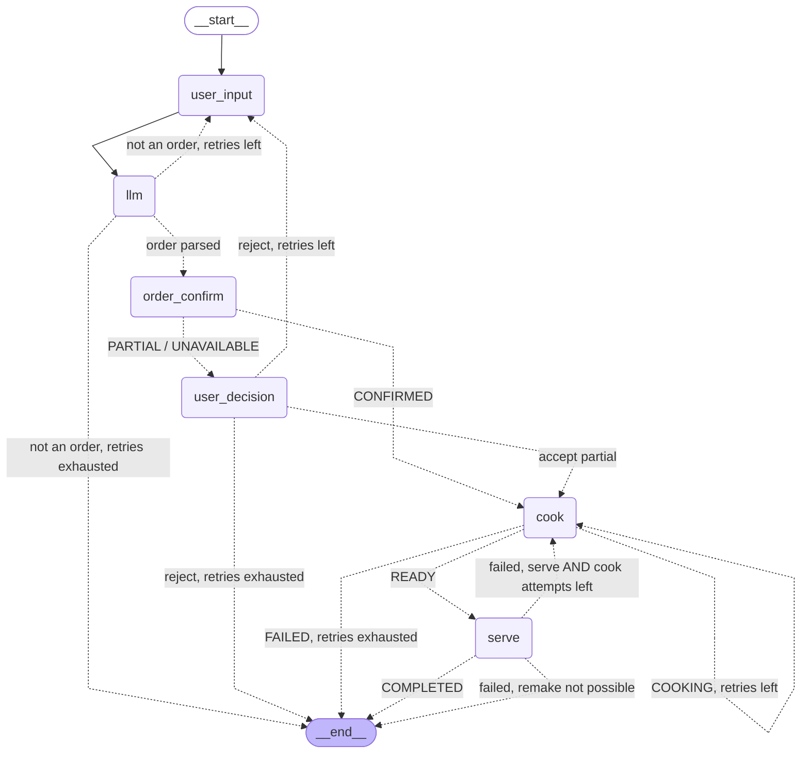

# LangGraph Workflow Diagram

Topology below is generated from the compiled graph
(`restaurant_agent/graph.py`); the edge labels mirror the conditional-edge
routers in `restaurant_agent/nodes.py`.

- **Solid edges** are unconditional.
- **Dotted edges** are conditional (chosen at runtime by a router function).
- Dotted **self-loops** on `cook` are the cook-retry path (`COOKING` status).

## Edge conditions (source of truth: `route_*` functions in `nodes.py`)

| From | Condition | To |
|---|---|---|
| `llm` | dish extracted | `order_confirm` |
| `llm` | not an order, `order_retries` left | `user_input` |
| `llm` | not an order, `order_retries == 0` | END (apology) |
| `order_confirm` | `status == CONFIRMED` | `cook` |
| `order_confirm` | `PARTIAL` / `UNAVAILABLE` | `user_decision` |
| `user_decision` | accepted partial (`dish_name` kept) | `cook` |
| `user_decision` | rejected, `order_retries` left | `user_input` |
| `user_decision` | rejected, `order_retries == 0` | END (apology) |
| `cook` | `status == READY` | `serve` |
| `cook` | `status == COOKING` (failed, attempts left) | `cook` |
| `cook` | `status == FAILED` (retries exhausted) | END (apology) |
| `serve` | `status == COMPLETED` | END (success) |
| `serve` | failed, **both** conditions hold: a serve attempt remains (`serve_retries > 1` after this failure) **and** a cook attempt is available (`cook_retries > 0`) | `cook` (remake; consumes one cook attempt) |
| `serve` | failed, remake not possible: no serve attempt remains (`serve_retries == 0`) **or** no cook attempt is available (`cook_retries == 0`) | END (apology — "cook retries exhausted - cannot remake the dish" when `cook_retries == 0`, otherwise "serving failed, retries exhausted") |

> **Note:** the remake edge requires **both** counters — `serve_retries` alone
> never permits a transition to `cook`. A failed serve with serve attempts
> left but an empty cook budget still ends the run, because the blocked
> transition is the cook retry. This gate lives inside the `serve` node
> (`nodes.py`); the router simply follows the `COOKING` status that `serve`
> sets only when the remake is permitted.
